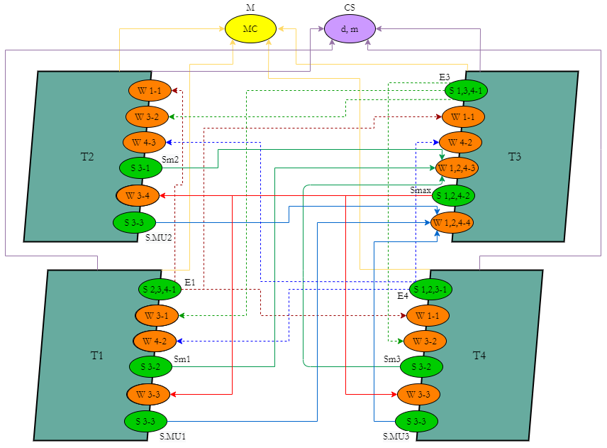

# Parallel and Distributed Calculations

<h3 align="center">Lab 1</h3>

Semaphores, mutexes, events, critical sections in WinAPI

<b>Task:</b> 

1. Develop a parallel algorithm for solving a mathematical problem `MU = MD * MC * d + max (Z) * MR` using `WinAPI` library in `C++`;
2. Identify shared resources;
3. Describe the algorithm of each thread (T1 - Ti) with the definition of critical areas and synchronization points (Wij, Sij);
4. Develop the structural scheme of interaction of threads where to apply all specified means of interaction of processes;
5. Develop a program;
6. Perform program debugging;
7. Get the correct calculation results;
8. Use Windows Task Manager to monitor CPU kernel load.

**Means of organizing interaction**: `semaphores, mutexes, critical sections, events`;

**Means of interaction**: `semaphores`.

<h4 align="center">Block diagram of the interaction of threads</h4>

Symbols in the block diagram:
	
* `CS` - to access the shared resource `d`, `m`;
* `M` - to access the shared resource `MC`;
* `E1` - for synchronization with the completion of input in `T1`;
* `E3` - for synchronization with the completion of input in `T3`;
* `E4` - for synchronization with the completion of input in `T4`;
* `Sm1`, `Sm2`, `Sm3`, `Smax` - to synchronize the calculations of the maximum `Z`;
* `S.MA1`, `S.MA2`, `S.MA3` - to synchronize the rest of the calculations and output the result.

    

<h3 align="center">Lab 2</h3>

Semaphores, mutexes, events, critical sections in WinAPI

<b>Task:</b> 

1. Develop a parallel algorithm for solving a mathematical problem `Z = sort(D * (ME * MM)) + (B * C) * E * x` in `C#`;
2. Identify shared resources;
3. Describe the algorithm of each thread (T1 - Ti) with the definition of critical areas and synchronization points (Wij, Sij);
4. Develop the structural scheme of interaction of threads where to apply all specified means of interaction of processes;
5. Develop a program;
6. Perform program debugging;
7. Get the correct calculation results;
8. Use Windows Task Manager to monitor CPU kernel load.

**Problem**: `Z = sort (D * (ME * MM)) + (B * C) * E * x`;

**Programming language**: `C#`;

**Means of organizing interaction**: `semaphores, mutexes, events, critical sections, atomic variables (types)`;

<h4 align="center">Block diagram of the interaction of threads</h4>

Symbols in the block diagram:
* `M` - mutex for access to the shared resource `b`;
* `volatile` - keyword to access the shared resource `x`;
* `Lock` - lock to access the shared resource `D`;
* `ME` - semaphore for access to the shared resource `ME`;

* `E0` - event for synchronization with the completion of input in `T1`;
* `E1` - event for synchronization with the completion of input in `T2`;
* `E2` - event for synchronization with the completion of input in `T3`;
* `E3` - event for synchronization with the completion of input in `T4`;

* `S0` - semaphore for synchronization with the completion of the merger `K` in the thread `T1`;
* `S1` - semaphore to synchronize the completion of calculations `ZH` in the thread `T2`;
* `S2` - semaphore to synchronize the completion of calculations `ZH` in the thread `T3`;
* `S3` - semaphore to synchronize the completion of calculations `ZH` in the thread `T4`;

* `SM0` - semaphore to synchronize the completion of the `K2H` merger in the thread `T2`;
* `SM1` - semaphore to synchronize the completion of sorting `KH` in the thread `T3`;
* `SM2` - semaphore to synchronize the completion of sorting `KH` in the thread `T4`.

    

